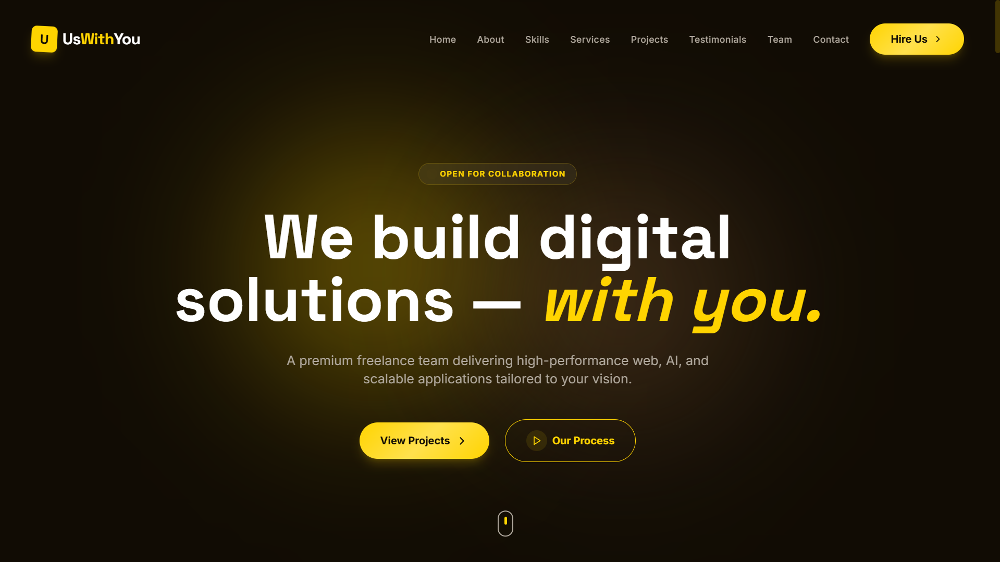
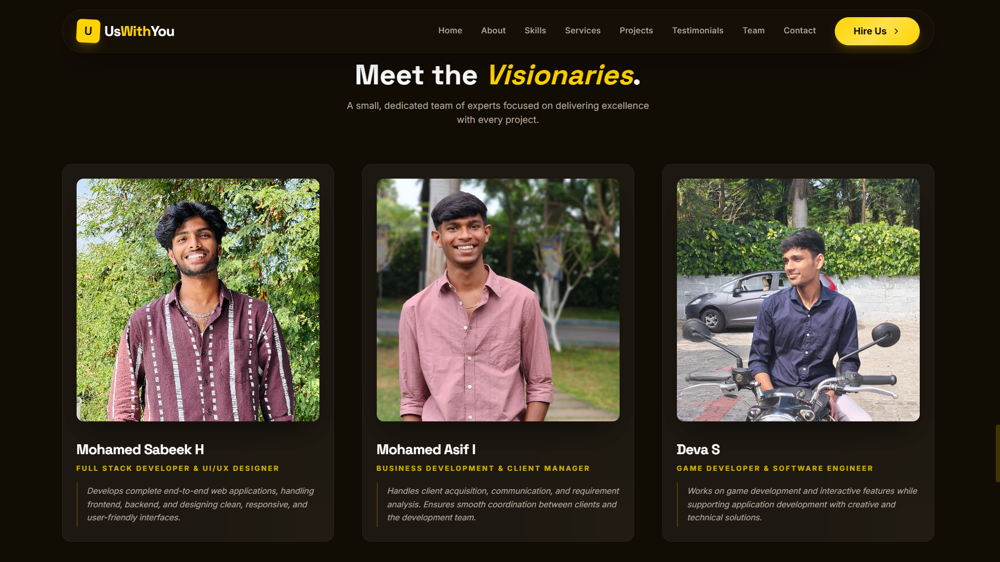

# 🚀 UsWithYou — Building Together, Every Step

**UsWithYou** is a modern freelancing team portfolio built to showcase our services, projects, and team.
We focus on building scalable, user-friendly, and high-performance web applications.

---

## 🌐 Live Demo

👉 https://uswithyou.vercel.app

---

## 📸 Preview

### 🏠 Homepage



### 👥 Team Section



---

## 👨‍💻 Team

* **Mohamed Sabeek H** — Full Stack Developer & UI/UX Designer
* **Mohamed Asif I** — Business Development & Client Manager
* **Deva S** — Game Developer & Software Engineer

---

## ✨ Features

* ⚡ Modern UI with responsive design
* 📩 Contact form powered by EmailJS
* 🎯 Clean and professional layout
* 🚀 Fast performance using Vite
* 🎨 Tailwind CSS styling
* 🔗 Social links integration

---

## 🛠️ Tech Stack

* **Frontend:** React, Vite
* **Styling:** Tailwind CSS
* **Email Service:** EmailJS
* **Deployment:** Vercel

---

## 📁 Project Setup

### 1. Clone the repository

```bash
git clone https://github.com/Mohamed-sabeek/uswithyou.git
cd uswithyou
```

### 2. Install dependencies

```bash
npm install
```

### 3. Setup environment variables

Create a `.env` file in the root folder:

```env
VITE_EMAILJS_SERVICE_ID=your_service_id
VITE_EMAILJS_TEMPLATE_ID=your_template_id
VITE_EMAILJS_PUBLIC_KEY=your_public_key
```

---

### 4. Run the project

```bash
npm run dev
```

---

## 🚀 Deployment

This project is deployed using **Vercel**.

To deploy:

1. Push your code to GitHub
2. Import the repository in Vercel
3. Add environment variables
4. Click deploy

---

## 📩 Contact

* Email: [uswithyou.team@gmail.com](mailto:uswithyou.team@gmail.com)
* Location: Coimbatore, India (Operating Globally)

---

## 💡 About Us

**UsWithYou** is a team dedicated to turning ideas into reality.
We work closely with clients to understand their vision and deliver solutions that are efficient, scalable, and visually appealing.

---

## ⭐ Support

If you like this project, feel free to ⭐ the repository and share it!

---
